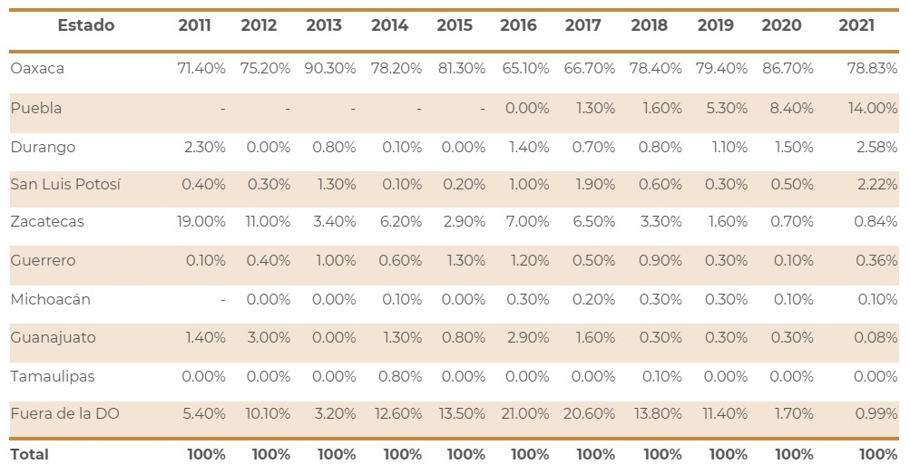
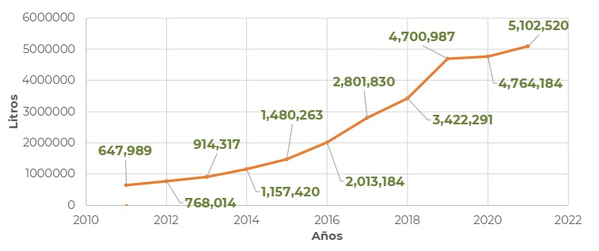
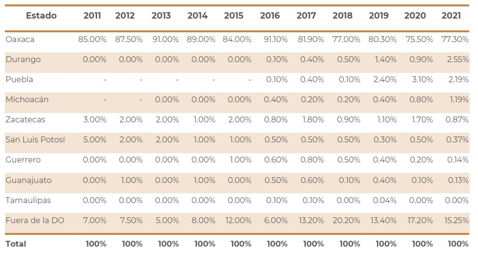
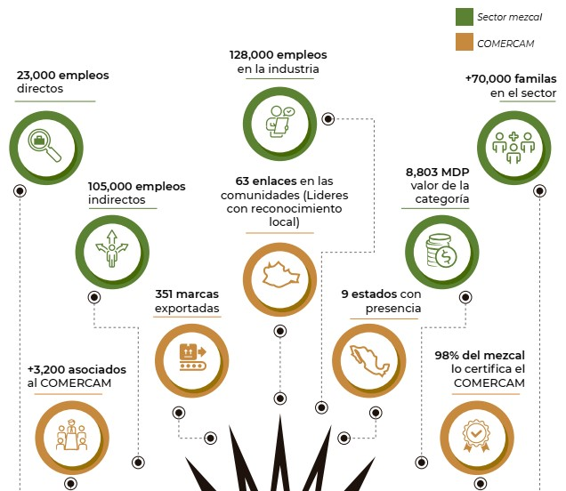
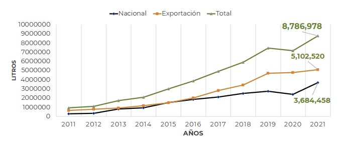
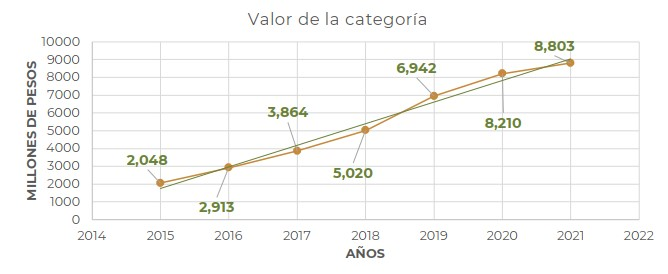

--- 
title: "Seminario-Taller: Mezcal, la bebida espirituosa más compleja del mundo"
author: "Omar Heredia-Portillo"
date: "`r Sys.Date()`"
site: bookdown::bookdown_site
---

# Una breve historia moderna

De acuerdo con el Consejo Regulador del Mezcal (2018):
La palabra Mezcal tiene su origen en la lengua náhuatl. Proviene de los términos “mexcalli” “metl” que significa maguey e “ixcalli” que significa cocido. Se refiere al maguey cocido que los pobladores de Mesoamérica utilizaban como alimento desde hace más de 9 mil años.
En Mesoamérica, los códices y las fuentes de la época colonial describen una gran variedad de bebidas fermentadas producidas antes del contacto con los europeos, especialmente bebidas cuya materia prima era el maguey, estas bebidas formaban parte de importantes rituales religiosos a los cuales sólo tenían acceso los nobles y sacerdotes de aquella época.
La práctica y las herramientas para producir este destilado se expandieron rápidamente en el siglo XVII. Cada comunidad utilizaba lo que su región y su cultura ofrecía para su elaboración, así cada región fue construyendo sus equipos, herramientas y métodos para la elaboración de su destilado, generando identidad, diversidad y reputación de acuerdo con el proceso regional empleado.
En el siglo XVIII la producción de mezcal era ya una industria en algunas regiones, la minería desempeñó un papel detonador en la producción y su consumo. Durante el periodo de la Nueva España, la corona prohibió el mezcal por considerarlo un pernicioso abuso en contra de la salud pública y, principalmente, por afectar intereses reales en torno a la importación de bebidas alcohólicas desde Europa. Pese a lo anterior, el mezcal encontró refugio en las haciendas, las comunidades agrícolas y en los pequeños productores que mantuvieron con vida la enseñanza de sus ancestros para la producción local. 
En la etapa de México independiente a finales del siglo XIX, en apoyo al desarrollo capitalista, visionarios introdujeron en Jalisco técnicas modernas de destilación. El mezcal elaborado en la comunidad de Tequila Jalisco adoptó la modernización en su proceso de destilado para con ello aumentar el volumen de producción y comenzar la explotación de su vino de mezcal conocido como Tequila.

De esta manera, como explica @Bowen2015 en su libro _Divided Spirits: Tequila, Mezcal, and the Politics of Production_:
El mezcal de la región de tequila se volvió popular en los Estados Unidos gracias a las ferias mundiales y la infraestructura que conjuntó Tequila, Jalisco, resultando en la industrialización del tequila de mezcal. El cual fue registrado como un producto con Denominación de Origen (DO) en 1974, el primero fuera de Europa. Mientras que la denominación del mezcal se estableció en 1994, con la diferencia de mantener producciones más limitadas y de agaves diversos. 
Sin embargo, la denominación de origen en vez de proteger los procesos, el lugar y las personas, ha homogeneizado las especies de agave, ha privado a los pequeños agricultores de las tierras y los empleos y ha eliminado la diversidad en el sabor de los aguardientes de agave que son exclusivos de las decisiones de producción artesanal y microambiental. 
El estándar del tequila restringe su producción a una sola especie de agave, Agave tequilana, y mientras que el estándar del mezcal permite una gran variedad de agaves que tradicionalmente han sido usadas. El terruño del mezcal es definido por consumidores con ingresos altos que están alejados de las realidades sociales y económicas de los productores, son amantes de los alimentos y las bebidas, y están dispuestos pagar un precio más elevado por los productos artesanales y étnicos de lugares inconcebiblemente accidentados y lejanos, imbuidos de espiritualidad y tradición. 

## Estadísticas
A medida que aumenta la demanda en ambos lados de la frontera, no todo es sol y rosas. Ha surgido una gran cantidad de preocupaciones a medida que las nuevas marcas llenan los estantes. Muchas de las nuevas etiquetas provienen de empresarios extranjeros (a veces sin intereses en la cultura o la historia del espíritu) que ingresan al mercado para comprar y volver a envasar líquidos con nombres llamativos. En el mejor de los casos, cuidan a las personas responsables de hacer este oro líquido y ayudan a preservar la herencia cultural del espíritu. En el peor de los casos, solo buscan ganar dinero rápido [@Janzen2017].

### Producción de mezcal

La producción nacional de mezcal 2021 referido a 45% Alc. Vol. equivale a 8´099,591.00 litros, siendo la categoría; Mezcal artesanal la principal producida con el 88.92%.

La producción nacional de mezcal 2021 referido a 45% Alc. Vol. equivale a 8´099,591.00 litros, siendo la clase; Blanco o joven la principal producida con el 99.37% [@Comercam2022].

Maguey espadín la principal empleada para la producción con el 88.11%.

### Envasado para el mercado nacional

### Envasado para el mercado de exportación

### Valor de la categoría

# Normatividad

## La denominación de origen del mezcal

Un producto con denominación de origen es un producto vinculado a la zona geográfica de la que es originario, siempre y cuando su calidad, características o reputación se deban exclusiva o esencialmente al origen geográfico de sus materias primas, sus procesos de producción, así como sus factores naturales o culturales.  Desde 1994, el MEZCAL cuenta con Denominación de Origen, y para garantizar su autenticidad se debe demostrar el cumplimiento de la Norma Oficial Mexicana NOM-070-SCFI-2016 Bebidas alcohólicas, Mezcal, Especificaciones. Actualmente, la Denominación de Origen Mezcal (DOM) comprende los estados de Oaxaca, Guerrero, San Luis Potosí, Zacatecas y Durango, además de 2 municipios de Guanajuato, 11 municipios de Tamaulipas, 29 municipios de Michoacán y 116 municipios de Puebla que se agregaron tras haber demostrado estos últimos estados que cuentan con una tradición en la producción de mezcal. Puntos imporytantes de la DOM:

_Nombre de la denominación de origen y producto o productos que se pretende ampar_ 

"MEZCAL", para ser aplicada a la bebida alcohólica destilada, denominada "MEZCAL" que se elabora con productos de acuerdo a la Norma Mexicana NMX-V-8-1993-SCFI, con agaves de las especies especificadas en dicha Norma. 

_Interés jurídico del solicitante_

Fundó su interés jurídico por ser una agrupación nacional, cuyo objeto social es el de procurar el mejoramiento de las Industrias Productoras de Agave y destilación de la bebida alcohólica denominada "MEZCAL", así como elevar el nivel social y económico de la población dedicada al aprovechamiento de la materia prima, producción, comercialización y distribución del "MEZCAL". 

_Señalamiento de la denominación de origen_ 

La materia prima para la elaboración de la bebida alcohólica es del género del agave con las especies establecidas en la Norma Mexicana antes citada; la siembra, cultivo y extracción de la materia prima se desarrolla en los estados de Guerrero, Oaxaca, Durango, San Luis Potosí y Zacatecas, particularmente en el Estado de Oaxaca existe una zona denominada de la "Región del Mezcal" comprendiendo los municipios de Solá de Vega, Miahuatlán, Yautepec, Tlacolula, Ocotlán, Ejutla y Zimatlán. 

## Creación y atribuciones del Consejo Mexicano Regulador de la Calidad del Mezcal, A.C. (COMERCAM)

Se constituyó en 1997 con la finalidad de evaluar el cumplimiento de la Norma Oficial Mexicana NOM-070-SCFI-2016 Bebidas Alcohólicas – Mezcal – Especificaciones, para el producto Mezcal que se produce y envasa en el territorio que comprende. El Consejo Mexicano Regulador de la Calidad del Mezcal A.C. (COMERCAM), desde sus orígenes en 1997 y próximo a cumplir 25 años, surge como el principal organismo regulador de la categoría cuyo objetivo es garantizar la autenticidad de la bebida mágica de México, el mezcal. Actualmente cuenta con más de 3200 asociados de toda la cadena productiva en nueve estados de la república, que día a día buscan que el trabajo del campo se vea reflejado en el destilado de mayor calidad que existe en el segmento de bebidas espirituosas en el mundo.

## Marco legal y normativo aplícable a la elaboración de mezcal

### NOM-070-SCFI-2016

La Norma Oficial Mexicana (NOM) establece las características y especificaciones que debe cumplir la bebida alcohólica destilada denominada Mezcal para su producción, envasado y comercialización [@Nom070]. A continuación se resaltan los puntos considerados de mayor importancia:

_3.17. Mezcal_

Bebida alcohólica destilada mexicana, 100 % de maguey o agave, obtenida por destilación de los jugos fermentados con microorganismos espontáneos o cultivados, extraídos de cabezas maduras de magueyes o agaves cocidos, cosechados en el territorio comprendido por la DOM. Es un líquido de aroma y sabor derivado de la especie de maguey o agave empleado, así como del proceso de elaboración; diversificando sus cualidades por el tipo de suelo, topografía, clima, agua, productor autorizado, maestro mezcalero, graduación alcohólica, microorganismos, entre otros factores que definen el carácter y las sensaciones organolépticas producidas por cada Mezcal..

_3.19. Productor autorizado_

Es la persona física o moral que cuenta con la autorización por parte del Instituto Mexicano de la Propiedad Industrial y la Dirección General de Normas de la Secretaría de Economía, previo dictamen del organismo evaluador de la conformidad, conforme a sus respectivas atribuciones para dedicarse a la elaboración de Mezcal dentro de sus instalaciones, las cuales deben ubicarse en el territorio comprendido DOM.

_3.21. Organismo evaluador de la conformidad (OEC)_

Es la persona acreditada como organismo de certificación, unidad de verificación o laboratorio de prueba, según corresponda, por una entidad de acreditación para la determinación del cumplimiento de la presente NOM, conforme a lo previsto en la Ley Federal sobre Metrología y Normalización, así como su Reglamento.

_3.22. Sello de certificación_

Es el distintivo que acredita la certificación del Mezcal.  Es un holograma que en su diseño incluye la imagen corporativa, marca del organismo evaluador de la conformidad y un código numérico único por botella. El holograma es proporcionado por el organismo evaluador de la conformidad al Envasador, previa demostración de que el producto a envasar cumple con esta NOM y los procedimientos de evaluación de la Conformidad.

_4.1. Materia prima para la elaboración de mezcal_

Están permitidos los magueyes o agaves, cultivados o silvestres, cuyo desarrollo biológico haya transcurrido en el área geográfica comprendida en la DOM y esté permitida su extracción por las autoridades competentes conforme a las leyes aplicables. Los magueyes o agaves, así como los predios de donde proceden, deben registrarse y estar geo-referenciados ante el OEC. Los magueyes o agaves deben estar maduros para cosecharse.Se debe contar con la guía de maguey o agave en el traslado de la materia prima entre un predio registrado y un productor autorizado de Mezcal.

_4.2. Categorías_

De acuerdo con el proceso específico utilizado de cocción del maguey o agave, molienda, fermentación y destilación, se obtienen tres categorías de Mezcal:

| Categorías de Mezcal |
| -- |
| Mezcal |
| Mezcal Artesanal |
| Mezcal Ancestral |

_4.3. Especificaciones fisicoquímicas_

El Mezcal debe cumplir con las siguientes especificaciones:

_5. Envasado_

Para envasar Mezcal se debe contar con autorización del OEC. Cuando el envasador lleve a cabo el envasado de otros productos distintos al Mezcal, debe contar en sus instalaciones con líneas diferenciadas de envasado, previamente autorizadas por el OEC, asegurando que el Mezcal no entre en contacto con líneas, contenedores o infraestructura que pudieran servir para el proceso, transporte o contención de otra bebida o producto alcohólico. El Mezcal que cumpla con las especificaciones fisicoquímicas, podrá envasarse únicamente como Mezcal clase Joven o Blanco, siempre y cuando no haya recibido ajuste de contenido alcohólico, en cuyo caso debe ser sujeto de un segundo análisis únicamente del % Alc. Vol., en términos de las especificaciones  del apratado 4.3. El producto terminado debe envasarse de manera manual o mecánica en recipientes conforme a la NOM-142-SSA1/SCFI-2014 y debe cumplir al menos 4 etapas:

a) filtración del producto terminado, debe utilizar filtro (s) para la captura de sólidos;

b) llenado;

c) taponado, y

d) sellado.

_6. Etiquetado_

El interesado debe obtener por parte del OEC, previo a iniciar el proceso de evaluación de la conformidad, el documento que demuestre el cumplimiento con lo establecido en este capítulo. El envase debe ostentar una etiqueta, cuya información debe ser legible a simple vista. Se pueden utilizar letras mayúsculas o minúsculas de forma indistinta. La información que se exprese en las etiquetas debe ser veraz, comprobable y exenta de textos, frases, imágenes, marcas y otras descripciones que induzcan o puedan inducir a error o confusión por engañosas o abusivas. Debe estar exenta de denominaciones, leyendas, nombres comerciales, clases y categorías asociadas o correspondientes a otras bebidas alcohólicas.

_6.1. Etiquetado para venta nacional_

a) Marca en la superficie principal de exhibición.

b) La leyenda: "Mezcal", "Mezcal Artesanal" o "Mezcal Ancestral" según su categoría, en la superficie principal de exhibición, debiendo incorporar exclusivamente una de ellas y de manera aislada de la marca con la que se distinga el producto.

c) La leyenda: "Joven" o "Blanco", "Madurado en Vidrio", "Reposado", "Añejo", "Abocado con" o "Destilado con" según su clase, en la superficie principal de exhibición, debiendo incorporar exclusivamente una de ellas y de manera aislada de la marca con la que se distinga el producto.

d) Únicamente el Mezcal Madurado en Vidrio y Añejo, debe manifestarse el tiempo de maduración y añejamiento en años cumplidos utilizando sólo números enteros, en la superficie principal de exhibición.

e) La leyenda: "100 % Maguey" o "100% Agave", en la superficie principal de exhibición.

f) Contenido neto, en la superficie principal de exhibición, de acuerdo con lo establecido en la  NOM-030-SCFI-2006.

g) Por ciento de alcohol en volumen a 20 °C, en la superficie principal de exhibición, debiendo aparecer a simple vista y debe abreviarse % Alc. Vol.

h) El nombre científico o tradicional (de uso común) del maguey o agave empleado.

i) En el caso de haber utilizado 2 o más especies de magueyes o agaves, se deben enumerar en orden cuantitativo decreciente.

j) La leyenda: DENOMINACIÓN DE ORIGEN PROTEGIDA, en letras mayúsculas, en un tamaño cuando menos de 3 mm.

k) El nombre del estado de la República Mexicana en donde fue producido el Mezcal.

l) Nombre o razón social, domicilio fiscal y R.F.C. de productor autorizado, envasador o comercializador titular.

m) Cada envase debe llevar grabada o marcada la identificación del lote a que pertenece que permita su rastreabilidad, debiéndose expresar en la etiqueta o en la botella. Se permite su presentación por escritura a mano de manera claramente legible, visible e indeleble para el consumidor.

n) La leyenda Hecho en México o Producto de México o el gráfico de indicación de procedencia es información opcional.

_7. Comercialización_

La presentación volumétrica para el consumidor final debe efectuarse en envases con un volumen máximo 5 L, ya sea para mercado nacional o exportación. La botella debe contar con el Sello de Certificación. Éste debe colocarse abarcando parte de la etiqueta que se encuentra en la superficie principal de exhibición y parte del envase. En cualquier otro caso, debe contar con la autorización del OEC.

Cualquier bebida alcohólica que utilice Mezcal en su elaboración, como ingrediente, debe obtener el certificado de cumplimiento conforme a lo dispuesto por la presente Norma Oficial Mexicana. Cualquier otro producto que exprese que utiliza Mezcal como uno de sus ingredientes debe demostrar la veracidad de dicha ostentación ante el OEC.

Para cada una de las operaciones de exportación de Mezcal se debe contar con el certificado correspondiente emitido por el OEC.

_8. Evaluación de la conformidad_

La Evaluación de la conformidad será realizada por la persona acreditada y aprobada (OEC) en términos de la LFMN, sin menoscabo de las facultades de verificación y vigilancia de las autoridades competentes.

El OEC debe evaluar:

a) Que el Mezcal cumpla con las especificaciones de la presente NOM.

b) Que el envasador cumpla con las especificaciones de la presente NOM.

c) Que el comercializador titular o licenciatario de marca cuente con los documentos y almacén(es) para comercializar Mezcal.

El productor autorizado debe obtener la autorización para el uso de la DOM por parte del IMPI.

Cuando el envasador y comercializador titular o licenciatario de marca sean distintos al Productor deben suscribir convenios de corresponsabilidad e inscribirlos ante el IMPI para hacer uso de la DOM de un productor autorizado.

El productor autorizado, envasador y comercializador titular o licenciatario de marca del Mezcal deben contratar al OEC para recibir los servicios de evaluación de la conformidad.

El productor autorizado debe demostrar con la certificación que su producto es auténtico, para ello, debe llevar una bitácora, que para tal efecto le proporcionará el OEC, donde registre los equipos utilizados en el proceso, la procedencia de la materia prima, el balance de materiales, inventario de Mezcal, análisis de laboratorio y destino del Mezcal entre otras operaciones e información jurídicamente válida que determine el OEC.

El envasador para ser certificado debe llevar una bitácora, que para tal efecto le proporcionará el OEC, donde registre los equipos utilizados en el proceso, la procedencia de Mezcal a granel, balance de materiales, inventario de Mezcal, análisis de laboratorio y destino del Mezcal envasado, entre otras operaciones e información jurídicamente válida que determine el OEC.

El comercializador titular o licenciatario de marca debe llevar una bitácora, que para tal efecto le proporcionará el OEC, donde registre la procedencia del Mezcal envasado, inventarios, análisis de laboratorio y destino del Mezcal comercializado, entre otras operaciones e información jurídicamente válida que determine el OEC.

La comprobación de lo establecido en la presente NOM se realiza a través de inspección permanente por parte del OEC, que se contrate para supervisar dicho proceso, independientemente que puede ser corroborado por cualquier autoridad competente o por una unidad de verificación acreditada. Este requisito se cumple a través del uso ininterrumpido de sistemas aleatorios  de inspección previamente aprobados por la DGN.

# Las especies de agave más utilizadas

En seguida se describen algunas de las especies de agave más comunes para hacer mezcal en la actualidad. La lista no es exhaustiva, sino más bien una instantánea de las tendencias en el mercado actual. La mayoría de los científicos y biólogos del agave argumentan en contra de hacer generalizaciones sobre lo que cada especie de agave contribuye al mezcal en términos de sabor final. Como se describió anteriormente, cada planta, incluso las de la misma especie, puede producir resultados diferentes dependiendo de dónde se cultivó y cómo se procesó. Dicho esto, no está de más probar qué sabores pueden producir ciertos agaves en un mezcal terminado para ayudarlo a navegar las complicadas aguas del mezcal. Las notas de sabor a continuación se compilaron a partir de una variedad de observaciones realizadas por camareros, propietarios de marcas y un servidor [@Janzen2017].

## Maguey Espadín (A. Angustifolia)

Quizás la especie de agave amigable con el mezcal más ampliamente distribuida, angustifolia es el padre de la variedad espadín, hasta la fecha, el mezcal más común exportado a los Estados Unidos. Con un equilibrio refinado entre la dulzura y la herbácea, el espadín de tamaño mediano suele tardar entre cinco y nueve años en madurar. Se cultiva fácilmente en Oaxaca, Michoacán, Durango y Puebla, donde se llama espadilla. En Sonora, el mezcal elaborado con la especie angustifolia se designa como bacanora, ya que el estado no se encuentra dentro de la Denominación de Origen formal del mezcal. Los recién llegados deben comenzar con un espadín por su excepcional equilibrio y personalidad amable [@Janzen2017].

## Maguey Cenizo (A. Durangensis)

El agave más usado para la producción de mezcal en Durango, la mayoría cosechado de poblaciones silvestres, resistente a heladas durante el invierno. Alcanza su madures entre los 10 y 12 años, el redimiento es de 20 kilos de agave por litro de mezcal. Se caracterisa por sus aromas frutados- cítricos, terrosos y dulces, con  sabor a granos de café tostado intenso, especias de madera y pan de pasas sutiles en la boca.

## Maguey Papalote o Chino (A. Cupreata)

Endémico de la cuenca del río Balsas en Guerrero, pero también cultivada en altitudes elevadas en Michoacán, Guerrero y Puebla (con focos de producción más pequeños en Oaxaca), el cupreata es una planta más baja y rechoncha. Por lo general, silvestre (estados como Guerrero están comenzando a cultivar rápidamente), el cupreata produce un mezcal de cuerpo liviano que tiende a tener un carácter brillante y floral, a veces con un final resinoso y a pino [@Janzen2017].

## Maguey Tobalá (Agave Potatorum)

Su distribución abarca el extremo oriental de la cuenca del río Balsas, el Valle de Tehuacán–Cuicatlán, pie de monte de las sierras Mixtecas y montañas que rodean los Valles Centrales de Oaxaca. Posiblemente es el maguey que menos tarda en fermentar, pues, después de ser cocido en un horno de piedra, con leña de encino o de sauce, y con un buen clima de por medio, sólo le toma de tres a cinco días aproximadamente; probablemente a causa de su gran reserva de hidrógeno, el principal acelerador de las levaduras, dando como resultado un mezcal con un grado de alcohol que ronda de los 47 a los 50 grados. Se caracteriza por ser aromático con un sabor donde se perciben frutas tropicales y notas un tanto picantes. 

## Maguey Azúl (A. Tequilana)

## Maguey Cuishe (A. Karwinski)

El Agave Karwinskii, es una especie microendémica limita su distribución en las zona áridas del valle de Tehuacán y los valles centrales de Oaxaca, entre los 750 y 2000m de altitud.  A diferencia de otros magueyes mezcaleros, es una planta que crece en áreas de suelos calizos y poca lluvia. Es un mezcal muy aromático que deja un retrogusto ligeramente amargo. Esta especie de maguey la dejan enmohecer después de cocerlo y antes de machacarlo para que se produzca un buen mezcal. El tomar un mezcal hecho de Agave Karwinskii es un privilegio ya que tuvieron que pasar 12 años para cortarlo, además debe llevar un proceso especial en su elaboración y no en todo el país se elabora.

# Proceso de producción de mezcal

## Materia prima

El primer paso para hacer mezcal es obtener y cosechar las plantas. Históricamente, la mayoría de los productores buscaban agaves maduros y listos en sus propias tierras. Todo crecía de forma silvestre, y el mezcal resultante se elaboraba a partir de una serie de variedades cocidas y mezcladas para formar un ensamble. Algunos productores simplemente compran plantas de agave crudas a agricultores o intermediarios para alcanzar las cantidades necesarias para cocinar un lote. Otros logran una combinación de los dos métodos: usan agaves silvestres y cultivados de sus propias tierras y compran una combinación de ambos a los intermediarios [@Janzen2017].

### Características de la planta

Para la elaboración de mezcal, se requiere que los agaves hayan logrado su estado de madurez para proceder a su corte (entre 7 a 8 años), en la cual la cantidad de azúcares es elevada para la producción de alcohol durante la fermentación. Esa condición de madurez se logra de manera natural, de acuerdo al ciclo de vida de cada especie y no necesariamente se ve reflejado en el tamaño de la cabeza o piña, por lo que algunas plantas son más pequeñas que otras. De acuerdo a la experiencia de los maestros mezcaleros, el tipo de suelo, la humedad, el grado de exposición al sol, el tipo de vegetación asociada y la geología del terreno, entre otros, son también algunos de los aspectos que influyen en el tamaño del agave y el tiempo en lograr su madurez [@Ciatej2014].

### Selección de la planta

La selección se realiza de acuerdo al grado de madurez, pueden considerarse las siguientes evidencias o señales [@Ciatej2014]: 

(1) Color de la hoja. En el caso del Agave cupreata, las hojas dispuestas alrededor del cogollo comienzan a ensancharse en su base y adquirir una forma romboide (angosta y gruesa), asumiendo una tonalidad diferente a las demás en la roseta (verde claro) y el conjunto de hojas de la parte central (cogollo), manifiesta un abombamiento .

(2) Velilla. Las hojas o pencas de la parte central del maguey (cogollo), comienzan a crecer un poco más largas y delgadas, que las dispuestas en la roseta. El maguey no desarrolla gran tamaño y comienza a cambiar de color. Generalmente desarrolla un Calehual delgado y bajo, y en algunas ocasiones no.

(3) Brote del quiote o Calehual. En la parte central del cogollo comienza a brotar el quiote o escapo, lo que indica que la planta ha entrado en su etapa de floración.

(4) Maguey Capón. Una vez que el calehual ha alcanzado una altura aproximada de un metro sobre las hojas, se procede a cortarlo con la finalidad de que acumule los azúcares suficientes. Despues, se deja pasar un periodo de tiempo suficiente (entre 8 y 12 meses), para que la planta pueda ser labrada.

### Labrado del maguey

Este proceso se realiza mediante el uso de una herramienta manual de corte, elaborada de hierro forjado denominada Tarecua (Guerrero), que es un objeto de forma plana semicurva muy afilado y con un mango de madera para su sujeción, a esta operación se le llama de diferentes formas: desvirar (región altiplano potosino-zacatecano y norte), jimado (A. tequilana en Jalisco) o labrado (Oaxaca y Guerrero). Se inicia con el corte de las pencas dispuestas alrededor del corazón o piña del maguey, incluyendo el tocón del Calehual en el caso de los magueyes capones, para luego con una barra se procede a tumbar la piña, acción que consiste en desprender la cabeza desde su base (a ras del suelo) separando el tallo de la raíz [@Ciatej2014].

### Traslado de la piña

Generalmente esta operación se realiza utilizando animales de carga (burros, caballos o mulas), debido a que la mayoría de las poblaciones silvestres, por ejemplo, de A. cupreata, se localizan en zonas de difícil acceso. Mientras que las piñas extraídas de plantaciones, generalmente son trasportadas en vehículos, ya que en su mayoría cuentan con caminos de acceso que se utilizan para ello [@Ciatej2014].

## Cocimiento

Consiste en someter las piñas o cabezas de agave (maguey) a un proceso de exposición lenta al calor, dentro de un sistema cerrado para su ablandamiento y cocción, provocando un proceso de hidrólisis de los fructanos del agave (polisacáridos) y que estos se conviertan en glucosa y fructuosa. Existen diversos equipos para la cocción, el más antiguo y rústico es el denominado horno de piso (tierra), de forma trunco cónica y en ocasiones ademado, los hay también de mampostería y autoclaves de acero inoxidable. Al término del cocimiento, las piñas de color blanco adquieren diferentes tonalidades de color que van de café-dorado a marrón oscuro, el más característico es el color caramelo, similar al del piloncillo, lo que indica que los polisacáridos se han convertido en azúcares fermentables, adquiriendo además una consistencia blanda [@Ciatej2014].La caramelización de algunos de los azúcares, que son compuestos que proporcionan sabores y aromas, notas que le imprimen características particulares a las bebidas derivadas de agave. Así mismo, a través del cocimiento se logra ablandar la consistencia dura que tiene el agave cuando esta crudo, lo que facilita el machacado, desgarrado y/o molienda que se realizará en la siguiente etapa del proceso de producción [@Ciatej2014].

### Preparación del horno

Previa la realización de la cargada, se procede a la limpieza del horno, retirando todos los residuos y restos de la cocción anterior como piedras calcinadas, carbón y ceniza. En este proceso se retiran también las piedras impregnadas con mieles de la hornada anterior. Esta práctica es hecha previamente antes de una nueva cargada. 

### Encendido del horno 

(1) Se prende fuego a la leña colocada al interior del horno, pudiendo utilizar como agente que favorezca la ignición y su encendido los alcoholes superiores o puntas. 

(2) Se espera a que las piedras adquieran la temperatura suficiente y que la mayor parte de la madera se consuma, lo cual se evidencia al no producir humo, reacomodándolas de manera que quede una superficie homogénea. 

### Carga del horno 

(1) Las piñas de agave crudas son pesadas previa colocación en el interior del horno, anotando los datos en una libreta o en un formato elaborado para ello. 

(2) Se aisla la base sobre de las piedras colocando una cama de bagazo y/o hojas de palma para que las piñas no tengan contacto directo con la piedra y evitar la carbonización. 

(3) Las piñas son colocadas de manera homogénea sobre la cama de manera que no queden huecos, apilándolas circularmente formando un domo.

(4) Las piñas son cubiertas con hojas de palma y/o cualquier otro elemento aislante (petates, cobijas, etc.), elaborados con fibras naturales (lana o algodón). 

(5) Se cubre el domo con una capa de tierra de manera homogénea para evitar fugas de calor y/o vapor durante la fase de cocimiento. 

(6) Antes del sellado, se incorpora agua a través de un orificio sobre la parte central del domo, una vez realizado este procedimiento se tapa el orificio. 

(7) Se espera a que transcurra el tiempo adecuado de cocimiento según la capacidad del horno. 

### Destapado del horno: 

(1) La cobertura de tierra es retirada, cuidando que no entre en contacto con las piñas cocidas, colocándola en el perímetro del horno. 

(2) Se retiran las hojas de palma y/o bagazo o cualquier material empleado. 

(3) Se espera el tiempo necesario para que las piñas se enfríen lo suficiente para un manejo seguro. 

(4) Se extraen las piñas cocidas del horno de forma manual. 

(5) Las piñas cocidas son trasladadas al área de molienda, colocándolas sobre el piso libre de polvo y basura, de preferencia sobre una cama de hojas de palma u otro elemento aislante para evitar el contacto con la superficie fría. 

(6) Las piñas de agave cocidas son pesadas nuevamente y registradas en la bitacora [@Ciatej2014].

## Molienda

El objetivo de la molienda es la obtención de los jugos o mieles, y conocer la concentración de azúcares deseados para establecer las relaciones necesarias de bagazo/agua y ajustar a los grados Brix deseados para el siguiente proceso. Esta etapa tiene tres variantes principales (manual, artesanal e industrial) según sea el tipo de equipo utilizado [@Ciatej2014]: 

(1) Equipo manual artesanal (marros y hachas principalmente);

(2) Tahona (equipo artesanal) 

(3) Molino desfibrador 

(4) Extractores industriales modernos (principalmente molino de tres masas)

## Fermentación

La fermentación tiene tres grandes objetivos [@Ciatej2014]: 

(1) Lograr una máxima conversión de los azúcares de los agaves en alcohol. 

(2) Generar compuestos volátiles agradables que repercutirán en la calidad del mezcal producido. 

(3) Evitar la producción de sustancias no deseadas como la acidez .

En esta etapa se realiza el cambio bioquímico de los azúcares reductores provenientes del agave en alcohol (principalmente etanol) y compuestos volátiles. La fermentación puede dividirse en dos subetapas: 

(1) Preparación del mosto. La preparación para la producción de mezcal se realiza utilizando sólo los azúcares del agave obtenidos en la molienda y en el cocimiento. En la formulación del medio se considera: a) La concentración de azúcares inicial; b)Las condiciones ambientales como la temperatura; y c) Los nutrientes requeridos por las levaduras (fosfato de amonio y cloruro de magnesio, principalmente). 

(2) Fermentación. Esta puede realizarse de manera espontánea o con una levadura preparada previamente. En este último caso después de preparar el mosto, se le agrega la levadura propagada previamente (fermentación inducida), o se dejan los mostos a cielo abierto para que se inocule naturalmente (fermentación espontánea). En los dos casos intervienen las levaduras para convertir los azúcares en alcohol y otros compuestos.

### Tinas de fermentación de hoyos en el suelo 

Consisten en hoyos en el suelo con un diámetro aproximado de 1.5 a 2.0 m y una profundidad de 2 m. Este tipo de tinas de fermentación se encuentran principalmente en lugares distantes de las ciudades en donde el suelo contiene barro. Las ventajas de tener tinas de fermentación en el suelo es que son muy baratas y pueden tenerse en casi cualquier fábrica de producción de mezcal siempre y cuando la tierra no sea porosa. Las desventajas es que la tierra misma causa contaminación del agave cocido y al estar al nivel del suelo incluso los roedores pueden caer dentro de las tinas de fermentación. 

### Tinas de fermentación de madera 

Este tipo de tinas de fermentación son las más utilizadas en los procesos de producción de mezcal. Tiene la ventaja de que la madera es un aislante por lo que la temperatura externa puede no influir tanto en la temperatura de la fermentación. Sin embargo, las tinas de madera son porosas y si no se les da una limpieza correcta pueden mantener por mucho tiempo microorganismos no deseados que pueden provocar la generación de compuestos no deseados como son los ácidos orgánicos.

### Tinas de cemento y/o piedra

En algunas zonas productoras de mezcal se han establecido tinas de fermentación de piedra como la cantera o de tabique forradas con cemento o con piso cerámico . Este tipo de tinas al igual que las de madera son porosas y deben ser limpiadas muy bien antes de adicionarles las fibras o el jugo de agave y también después de la fermentación.

### Tinas de fermentación de cuero de res 

Para eso los productores le quitan a los animales la piel lo más completa posible, posteriormente las cosen con hilos de las patas para formar un recipiente. Posteriormente, los llenan de agua y todos los días se suben a las pieles para estirarlos lo más posible para obtener recipientes con el máximo volumen posible. Este tipo de tinas tiene la ventaja que pueden ponerse en cualquier empresa mezcalera, además de que son térmicas y conservan la temperatura interna de las tinas, la limpieza es sencilla y normalmente no le quedan residuos de fermentaciones anteriores. La desventaja es que el volumen de funcionamiento no sobrepasa los 200 L y se requieren de varias tinas para tener una producción pequeña.

### Tinas de fermentación de plástico 

En los últimos años se han estado utilizando tinas de fermentación de plástico de los llamados rotoplas. Estos tanques pueden adquirirse a precios accesibles, por lo que es común encontrarlas en varias fábricas de producción de mezcal. Las ventajas de este tipo de tinas, es que el plástico sirve como aislante y puede mantener la temperatura interna a pesar del frio externo. Sin embargo la desventaja es que las tinas están hechas de polímeros derivados del petróleo, que pueden contener solventes. El jugo de agave es muy corrosivo y con cualquier corte o daño en el plástico se corre el riesgo de contaminar el jugo de agave y pasar hasta el producto final, es por eso que no se recomienda utilizarlos.

### Tinas de fermentación de acero inoxidable 

Las tinas de acero inoxidable son poco utilizadas en los procesos de producción de mezcal debido a que son muy costosas y rompen la imagen del proceso artesanal. La ventaja es que son muy resistentes y facil de limpiar evitando suciedad en las paredes. Además, se pueden mandar a fabricar bajo medida e incluso con tapa para evitar que polvo o animales se introduzcan. También en su fabricación es posible poner descargas de jugo dirigidas hacia los alambiques para la destilación al final de la fermentación.

## Destilación

Es el método empleado para separar y concentrar los componentes químicos y sensoriales producidos en las etapas de proceso previas, desde el cocimiento hasta la fermentación, aprovechando para ello las distintas propiedades fisicoquímicas y termodinámicas de los mismos. La aplicación de la destilación en el proceso de elaboración de mezcal, se involucran los siguientes principios: 

(1) Creación de un sistema de dos fases mediante la vaporización del mosto fermentado o del ordinario o simple; 

(2) Transferencia de masa entre las fases; 

(3) Separación de las fases (vaporización-condensación);

La destilación tradicional (con alambiques de cobre) comprende dos etapas:

(1) Destrozamiento. Tiene por objetivo separar el etanol y otros compuestos químicos volátiles de los otros componentes del mosto fermentado como agua, levaduras y debris o residuos celulares, azúcares residuales, fibra o bagazo y sales minerales.

(2) Segunda destilación o rectificación (refinada). Tiene como objetivo alcanzar un grado alcohólico superior al 40% Alc. Vol. en el destilado y se inicia vaciando a la olla o hervidor las garrafas obtenidas en la primera destilación para enseguida tapar la olla y sellarla, colocar el cuello de cisne e iniciar el calentamiento. 

## Acabado y envasado del mezcal

El volumen obtenido de la segunda destilación, es un destilado con un grado alcohólico que puede ir del 45 al 60% Alc. Vol. A este rectificado no se le puede considerar todavía como un producto terminado que pueda ser puesto en un envase adecuado para su distribución y venta al consumidor, por ello es necesario aplicar diversas técnicas de acabado del producto para que este logre la calidad conforme a la NOM-070. Los procesos de acabado del rectificado tienen el objetivo de obtener el mezcal en el grado alcohólico y con las características químicas y sensoriales que el envasador pretende, de acuerdo a las particularidades de su producto, marca, mercado objetivo entre otros factores. No todos los productores de mezcal pretenden poner en uso alguna técnica de acabado ya que preferirán señalar que su producto es 100% natural, otros pretenderán suavizar el sabor del mezcal para reducir la sensación de astringencia en boca que proporciona el etanol, por tanto las técnicas aquí mencionadas para lograr un producto terminado podrán o no aplicar para todos los productores.

### Maduración del mezcal en barricas

Esta operación se realiza cuando se pretende que el mezcal presente notas sensoriales características de la madera. El tiempo en que un mezcal debe estar en las barricas depende del perfil sensorial que se pretenda que tome el producto en la barrica, por tanto, esto deberá realizarse en la práctica a manera por medio de pruebas a fin de determinar el tiempo de reposo o de añejamiento. 

### Dilución del destilado rectificado al grado comercial 

Una vez que se ha definido el grado alcohólico del producto a envasar del rectificado obtenido de la segunda destilación, se debe disponer de la cantidad de agua necesaria así como revisar la calidad de esta agua de dilución. Las características del agua de dilución son en primer lugar, que sea agua potable (apta para consumo humano) y en segundo, que sea desmineralizada. Esta última característica es crítica ya que permitirá que el mezcal sea estable y no presente alguna turbiedad una vez envasado. La cantidad de agua necesaria, puede calcularse a partir de conocer el volumen de litros de mezcal de alta concentración, de su grado alcohólico y del grado alcohólico al que se pretende dejar el volumen de mezcal diluido.

# Control de calidad del mezcal

## Calidad fisicoquímica

El principal objetivo de realizar un control de calidad en el producto terminado, acotado en este caso particular al Mezcal, es asegurar el cumplimiento de las especificaciones marcadas en su NOM-070, que garantice un producto de calidad estandarizado en el mercado. La calidad del mezcal como producto terminado, depende en gran medida del cuidado y control de todos los factores que intervienen a lo largo del proceso de producción mencionados anteriormente [@Ciatej2014]: 

(1) El tipo y edad de agave; 

(2) El tipo de horno y condiciones de cocimiento; 

(3) La manera en que se lleva a cabo la molienda; 

(4) La relación de bagazo/agua, tiempos de fermentación y microorganismos diseminados en el ambiente de las fábricas que constituirán el inóculo nativo en la fermentación; 

(5) El tipo de alambique, temperaturas y cortes durante la obtención del ordinario (simple) y el rectificado (refinado o emparejado); 

(6) El tiempo de reposo y tipo de barrica si el producto es madurado o envejecido y; 

(7) El proceso de acabado o terminado así como el tipo de envase utilizado para contener el producto, son algunos de los factores determinantes de la calidad fisicoquímica y sensorial del mezcal.

### Porcentaje de alcohol en volumen (a 20° C)

Es el grado volumétrico que expresa en volumen a 293°K (20°C), la cantidad de alcohol etílico puro contenido en 100 volúmenes a 293°K (20°C) de una mezcla hidroalcohólica [@Ciatej2014].

### Extracto seco

El extracto seco total es el conjunto de todos los componentes no volátiles de las bebidas alcohólicas en determinadas condiciones; tales que esos componentes sufran el mínimo de alteración [@Ciatej2014].

### Acidez total

La acidez son los caracteres dados a las bebidas alcohólicas, por la presencia de ácidos naturales provenientes de la materia prima que los origina, del proceso de elaboración y/o maduración. Mientras que la acidez total es la que contiene una bebida alcohólica como consecuencia de todos sus ácidos, volátiles y no volátiles [@Ciatej2014].

### Alcoholes superiores

Los alcoholes superiores son compuestos orgánicos con más de 2 átomos de carbono y uno o más grupos hidroxilos. Los principales alcoholes superiores de las bebidas alcohólicas son: propanol, el 2-butanol, feniletil alcohol, el alcohol isobutílico (2- metil-propanol) y los alcoholes amílicos (mezcla de 2- metil-butanol, 3- metil-butanol y 1-pentanol). A la mezcla de estos cuatro últimos alcoholes se le llama aceite de fusel. La formación de estos alcoholes se atribuye a los azúcares de las bebidas a través de los cuales se sintetizan los aminoácidos [@Ciatej2014].

### Metanol

El metanol es un alcohol que se encuentra presente en todas las bebidas alcohólicas en mayor o menor proporción incluso en trazas. Proviene de la hidrólisis de las pectinas (pectinas solubles y propectinas), de las materias primas vegetales que se fermentan [@Ciatej2014].

## Calidad sensorial

El mezcal debe cumplir con las especificaciones fisicoquímicas establecidas en la NOM. Sin embargo, el cumplimiento de los parámetros fisicoquímicos, no garantiza que el mezcal tenga una imagen sensorial que agrade al consumidor, por lo que al posicionarlo en el mercado se corre el riesgo de tener una baja preferencia, o incluso de ser rechazado [@Ciatej2014]. Por el contrario, existe también la posibilidad de que un mezcal que sea aceptado sensorialmente por los consumidores, no cumpla con las especificaciones de calidad fisicoquímica y su consumo represente un riesgo mayor para el consumidor en cuanto a su toxicidad. Debido a esto, en el contexto global, es deseable e importante evaluar y garantizar tanto la calidad fisicoquímica, como sensorial del mezcal [@Ciatej2014].

La calidad sensorial del mezcal, se define por la conjunción de sensaciones que experimenta una persona al ingerirlo y está asociada directamente con sus atributos sensoriales, los cuales son percibidos por el consumidor y en muchos casos determinan su elección, preferencia o rechazo [@Ciatej2014]. Entonces, los atributos sensoriales del mezcal son un indicador que permite a los productores y distribuidores de mezcal conocer, por un lado, las características percibidas por los consumidores (positivas o negativas) y por otro lado los atributos de tipicidad y diferenciación de cada mezcal. La calidad sensorial se basa en la reacción que provocan los diferentes componentes, en este caso de la bebida alcohólica denominada mezcal en los sentidos de los consumidores lo cual parte de la identificación de los siguientes atributos @Ciatej2020: 

(1) Olor y aroma. Percibidos por el sentido del olfato ubicado en la parte superior de la nariz, al final del laberinto nasal. El olor y aroma del mezcal son dados por los compuestos volátiles;

(2) Gusto. Percibido por el gusto formado por las papilas gustativas presentes en la lengua. Son 4 gustos percibidos por las papilas gustativas: dulce, amargo, ácido y salado. En el mezcal, el amargo es el gusto que se percibe por la mayoría de los consumidores; 

(3) Apariencia, color, consistencia. Percibidos por la vista y tacto, principalmente;

(4) Sensaciones trigeminales. Tales como quemante, picante en garganta, astringente, percibidos gracias a las terminaciones trigeminales presentes en las mucosas de la boca, garganta y naríz.

# Econtrando el mezcal ideal

A estas alturas, con suerte, te darás cuenta de que hay tanta diversidad en la categoría que podrías probar diferentes expresiones por el resto de tu vida y probablemente aún así descubrirás un nuevo sabor todos los días. Es increíblemente emocionante. Por otro lado, esa misma amplitud de diversidad puede ser uno de los aspectos más intimidantes del mezcal. Ya sea en el bar o en la licorería, mirar hacia abajo docenas de botellas puede resultar confuso en el mejor de los casos. Cada uno proviene de un productor o región diferente, utiliza diferentes plantas de agave y agrega sus propios giros en el proceso de producción. ¿Donde empezar? ¿Cómo sabes qué agave te hablará? Con puntos de precio altos y sin ninguna guía, el proceso puede ser una apuesta [@Janzen2017]. 

Una de las mejores maneras de conocer el espíritu es encontrar un cantinero de confianza en un lugar con una selección de mezcales saludables y dejar que lo guíe a través del viaje. Lo más probable es que hayan investigado y hayan dedicado innumerables horas a probar cada marca y variedad, lo que significa que podrán ayudarlo rápida y fácilmente a encontrar una buena combinación. Pero, si eres un obstinado independiente, aquí hay algunas sugerencias para navegar por las aguas del mezcal por tu cuenta [@Janzen2017].

## Por variedad

Organice algunas muestras de la misma especie para tener una idea general de un estilo determinado. Comience con espadín, la variedad más disponible (y más asequible). A medida que los agaves más raros llegan al mercado, algunas personas comienzan a pensar en el espadín como la opción aburrida, pero eso es apresurarse. El hecho de que sea omnipresente no significa que sea aburrido [@Janzen2017]. 

El espadín de _nuestras marcas_ sabe más dulce y afrutado que el espadín de Mezcal _nuestras marcas_, por ejemplo. Ambos son deliciosos, por diferentes razones. El espadín de _nuestras marcas_ sale balanceándose con un carácter grande y bullicioso, mientras que _nuestras marcas_ tiende hacia el extremo más modesto del espectro. Una vez que obtienes una buena línea de base en espadín, no está de más volverse un poco salvaje, si el bolsillo lo permite. Pruebe algunos vertidos de la familia karwinskii, como cuishe, madre-cuishe, bicuixe o largo.

## Por categoría

_Mezcal._ Su elaboración debe cumplir con al menos las siguientes cuatro etapas y equipo @Nom070:  

a) Cocción: cocimiento de cabezas o jugos de maguey o agave en hornos de pozo, mampostería o autoclave.  

b) Molienda: tahona, molino chileno o egipcio, trapiche, desgarradora, tren de molinos o difusor.  

c) Fermentación: recipientes de madera, piletas de mampostería o tanques de acero inoxidable.  

d) Destilación: alambiques, destiladores continuos o columnas de cobre o acero inoxidable.

_Mezcal artesanal._ Su elaboración debe cumplir con al menos las siguientes cuatro etapas y equipo @Nom070:  

a) Cocción: cocimiento de cabezas de maguey o agave en hornos de pozo o elevados de mampostería.  

b) Molienda: con mazo, tahona, molino chileno o egipcio, trapiche o desgarradora.  

c) Fermentación: oquedades en piedra, suelo o tronco, piletas de mampostería, recipientes de madera o barro, pieles de animal, cuyo proceso puede incluir la fibra del maguey o agave (bagazo).  

d) Destilación: con fuego directo en alambiques de caldera de cobre u olla de barro y montera de barro, madera, cobre o acero inoxidable; cuyo proceso puede incluir la fibra del maguey o agave (bagazo).

_Mezcal ancestral._ Su elaboración debe cumplir con al menos las siguientes cuatro etapas y equipo @Nom070:  

a) Cocción: cocimiento de cabezas de maguey o agave en hornos de pozo.  

b) Molienda: con mazo, tahona, molino chileno o egipcio. 
c) Fermentación: oquedades en piedra, suelo o tronco, piletas de mampostería, recipientes de madera o barro, pieles de animal, cuyo proceso puede incluir la fibra del maguey o agave (bagazo).  

d) Destilación: con fuego directo en olla de barro y montera de barro o madera; cuyo proceso puede incluir la fibra del maguey o agave (bagazo).

## Por clase

_Blanco o joven._ Mezcal incoloro y translucido que no es sujeto a ningún tipo de proceso posterior [@Nom070].

_Madurado en vidrio._ Mezcal estabilizado en recipiente de vidrio más de 12 meses, bajo tierra o en un espacio con variaciones mínimas de luminosidad, temperatura y humedad [@Nom070].

_Reposado._  Mezcal que debe permanecer entre 2 y 12 meses en recipientes de madera que garanticen su inocuidad, sin restricción de tamaño, forma, y capacidad en litros, en un espacio con variaciones mínimas de luminosidad, temperatura y humedad [@Nom070].

_Añejo._ Mezcal que debe permanecer más de 12 meses en recipientes de madera que garanticen su inocuidad de capacidades menores a 1000 litros, en un espacio con variaciones mínimas de luminosidad, temperatura y humedad [@Nom070].

_Abocado con._ Mezcal al que se debe incorporar directamente ingredientes para adicionar sabores, tales como gusano de maguey, damiana, limón, miel, naranja, mango, entre otros, siempre que estén autorizados por el Acuerdo correspondiente de la Secretaría de Salud, así como en la NOM-142-SSA1/SCFI-2014 [@Nom070].

_Destilado con._ Mezcal que debe destilarse con ingredientes para incorporar sabores, tales como pechuga de pavo o pollo, conejo, mole, ciruelas, entre otros, en términos de la presente Norma Oficial Mexicana [@Nom070].

# Técnica de cata

Para realizar una cata de mezcal, es importante tomar en cuenta 4 características importantes del destilado: (1) Color; (2) Cuerpo; (3) Aromas; y (4) Sabor. Este ultimo, sabor, es el más importante, ya que influye en la decisión de compra sobre un producto y otro, independientemente de la variedad de agave, categoría, clase o marca. Para realizar el catado es necesario contar con la copa correcta. La copa ideal puede ser la oficial para la cata de tequila (Riedel Ouverture Bar Tequila). Esta copa está diseñada para apreciar de mejor manera las cuatro 4 características principales de los destilados de agave. 

## Color

Para conocer el color del mezcal, solo se lleva la copa a la altura de los ojos para asignarle algún color, transparencia y brillo al producto. 

## Cuerpo 

Para conocer el cuerpo, se agita la copa asegurándo de que el líquido se adhiera a las paredes formando una corona en la parte superior. De esta corona se desprenderán las lágrimas o piernas. Después, se podrá definir el cuerpo del mezcal como ligero, medio o entero, esto dependerá de que tan rápido desciendan las gotas y de que tan pegadas estén una de la otra. 

## Aroma

Se dice que en los mezcales existen muchos aromas. Es un poco complicado poder percibirlos todos, por eso es mejor concentrarse en las notas primarias, que son aquellas dadas por el proceso. Éstas se pueden percibir, entre muchos otros, como:

(1) Lácteos

(2) Cárnicos

(3) Cítricos

(4) Herbales  

## Sabor 

Para este último paso, es importante conocer los sabores que se perciben en boca y que son:          

(1) Dulce, en la parte frontal de la lengua         

(2) Salado, a los costados frontales         

(3) Ácido, en costados traseros         

(4) Amargo, en la parte trasera de la lengua  

Cada una de estas partes trabajan a diferentes temperaturas por lo que es sumamente importante mantener el trago en boca durante mínimo 10 segundos. Antes de realizar todo este proceso es importante también avisarle al sistema nervioso lo que esta a punto de recibir, ¿cómo le avisamos? por medio de la vista, el olfato y el paladar. Para preparar a este último, es importante que acostumbremos la papila gustativa al alcohol dándole primero un pequeño sorbo al mezcal, de esta forma, la papila gustativa producirá saliva y estará lo suficientemente húmeda como para recibir el trago. Una vez preparadas las papilas, entonces se procede a realizar la degustación. Es así como se podrán percibir todos los sabores.  

En el proceso de degustación es también muy importante que el aire se exhale por la nariz con boca cerrada. De esta manera tendrás una alimentación retronasal que te ayudará a aumentar los sabores en boca. Muchas personas exhalan el aire por la boca después de dar el trago para no percibir el sabor o lo quemante del alcohol, pero comenten un gran error, ya que se les dificultará poder percibir los sabores en boca.  

Este proceso tendrá que repetirse con cada uno de los mezcales que se vayan a catar.

# Maridaje y/o acompañamiento

Existen dos formas de maridar las bebidas con los alimentos por complementación y por contraste. En la complementación, los sabores del platillo y la bebida se refuerzan entre sí, mientras que, cuando es por contraste, las diferencias entre el sabor del destilado y el de los alimentos hace resaltar las bondades de ambos.  Cuando se trata de maridar un mezcal, existe un sinfín de posibilidades, pues este destilado se puede combinar con sabores dulces, amargos, agrios y salados. 

De hecho, gran parte del auge en el consumo del mezcal se debe a su sabor ahumado característico y a sus diversas formas de mezclarse con otros ingredientes.  Si bien el maridaje con mezcal puede realizarse con gran variedad de sabores, los platillos tradicionales de la gastronomía mexicana son los principales que deben acompañarse con este exquisito destilado. La mayoría de los platillos nacionales incluyen en su receta condimentos que a la hora de mezclarse con el mezcal hacen la mancuerna ideal.

Algo importante es que cualquier mezcal es ideal para maridar con comida grasa, pues su carácter cítrico ayuda a limpiar el paladar. De esta manera, si planeas comer embutidos, carnes, mayonesas o algún otro alimento rico en grasa, el mezcal quedará perfecto con ellos. 

## Maguey Espadín (A. Angustifolia)

Debido a su suavidad, el espadín ayuda a neutralizar las notas picantes. De esta manera, los platillos en donde el chile sea predominante quedarán de maravilla con este mezcal, pues permitirá apreciar sabores más escondidos y no solo lo abrumador del picante. También puede ser maridado con una amplia gama de sabores, que van desde los dulces, pasando por alimentos con toque ahumado o ingredientes cítricos. Este tipo de mezcal va bien con tiraditos, ceviches, carnes magras y postres. 

Platillo sugerido: tostada de salpicón de betabel con chayote. La mineralidad y notas herbáceas del mezcal se complementan con el dulzor del betabel y lo mineral del maíz.

## Maguey Cenizo (A. Durangensis)

Es recomendable acompañar con fresas y uvas que van muy bien con sus notas cítricas, ahumadas, dulces y frutales, incluso de tabaco y chocolate.

## Maguey Papalote o Chino (A. Cupreata)

El maridaje perfecto de este mezcal es con mole pues aporta un excelente contraste. En especial el mole verde y amarillo. También para la cecina y platillos bien condimentados y postres acentuadamente dulces.

## Maguey Tobalá (Agave Potatorum)

Gracias a sus notas frutales, contrastará de manera perfecta con los alimentos salados, es decir, con carnes frías, cacahuates o frituras saladas, quesos, por mencionar algunos. El maridaje entre alimentos dulces y el mezcal tobalá funciona por armonía, ya que sus maravillosas notas frutales quedan bien con los sabores dulces. De igual forma, va bien con alimentos con un poco más de grasa y algunos otros ácidos-dulces. Aunque el líquido es más complejo que un vino, puede ser su sustituto perfecto, yendo bien con quesos, embutidos, uvas, manzana verde y platillos especiados, presentes en la amplia gastronomía mexicana.  

Platillo sugerido: un crudo de pescado con pera, salsa de xoconostle y jalapeño; así como un pastel de queso de cabra con durazno confitado y diplomat de mezcal. Con el platillo salado, lo que complementa son las notas frescas y especiadas de los ingredientes, que van bien con el cuerpo del Tobalá; mientras que para el postre, la combinación despunta las notas generadas en la fermentación, que para esta variante son lácticas, mismas que se refuerzan con el queso de cabra.

## Maguey Azúl (A. Tequilana)

Es recomendable realizar un maridaje con alimentos de la misma frescura y que reúnan los sabores cítricos del destilado, que dejen una sensación de mineralidad en el paladar. Algunas opciones son los gazpachos, sopas frías mentoladas y mariscos, mejillones, camarones y callo de hacha.

## Maguey Cuishe (A. Karwinski)

Por su fuerte aroma a musgo y humedad, persistentes sabores a clavo, pimiento blanca, canela y manzanas, es excelente para acompañar con pollo, ensaladas o menús mediterráneos.

# Mixología con mezcal

El cóctel es la introducción, enciende esa luz de curiosidad que hace que la gente quiera probar ese mezcal [@Janzen2017]. Sin embargo, al conocer los tiempo de crecimiento de la planta, su rendimiento final en la destilación y sus carcaterísticas organolépticas, indica que el mezcal más apto para mezclar es el Espadín, porque es el que tarda menos en crecer y es el más abundante "hay que respetar la planta". Por ejemplo, el tepestate es una planta que tarda cerca de 25 años en madurar, por lo que sería “una falta de respeto a la naturaleza” utilizar este tipo de agave para hacer tragos.

## Fresco. Bebidas cítricas y frutales

## Tradicionales

# Referencias{-}

